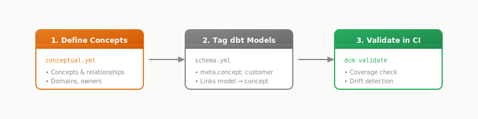

# What is dbt-conceptual?

**A lightweight way to keep your conceptual model alive alongside your code.** Shared vocabulary that lives in your repo, validates in CI, and stays current because it's part of your workflow.

---

## The Whiteboard Moment

If you've worked on a data project, you've probably experienced this. Business stakeholders, architects, and engineers gather around a whiteboard. Someone draws a box labeled "Customer." Another box: "Order." A line between them. Discussion follows: "Can a customer exist without an order?" "What about returns — is that a separate concept or a type of order?"

By the end of the session, the whiteboard is covered in boxes and lines. Everyone nods. For that moment, there's shared understanding — a common vocabulary for what the business *means* when it talks about its data.

Then someone takes a photo. The photo goes into Confluence. The project moves forward.

Six months later, that photo feels like archaeology.

If this sounds familiar, you're not alone.

---

## The Effort Paradox

Many teams try to solve this with better tooling. The whiteboard photo gets redrawn in Visio or Lucidchart. Someone cleans it up, adds proper notation, makes it look official. It goes into the architecture wiki.

And yet, it tends to drift.

Some teams go further — ERwin, Visual Paradigm, Enterprise Architect. Real conceptual modeling tools. Maybe there's a dedicated data modeler who maintains the model. Weeks of effort go into building a proper, normalized, well-documented conceptual model.

And still, it tends to drift.

The challenge isn't lack of effort. It's **disconnection**. These tools live in their own ecosystems — separate from git, separate from dbt, separate from the CI/CD pipeline. Updating the model means context-switching into a different tool, different workflow, different mental model. That friction accumulates. Every update becomes a small project. Small projects get deprioritized.

There's a certain irony here: the more effort you invest upfront, the more painful the drift becomes later.

| Investment Level | Artifact | What Happens |
|-----------------|----------|--------------|
| Low | Whiteboard photo | Easy to dismiss — everyone knows it's informal |
| Medium | Visio/Lucidchart diagram | Looks authoritative but may not be current |
| High | ERwin/Enterprise Architect model | Significant investment — harder to decide whether to update or start over |

The traditional tools aren't the problem — they're good at what they do. The challenge is that they exist outside the delivery workflow. As long as the conceptual model lives in a separate tool, on a separate cadence, it tends to drift from reality.

---

## What Changed

The traditional modeling flow looked something like this:

1. **Conceptual model** — Architect and business stakeholders define shared vocabulary
2. **Logical model** — Architect derives normalized structure
3. **Physical model** — Engineers implement for specific platform
4. **Change request** — Back to step 1, cascade updates through all layers

This worked well when releases shipped quarterly. It worked when teams could afford the round-trip through formal review. It worked when the data architect owned the timeline.

Then delivery accelerated. dbt democratized transformation. Teams started shipping daily. The architect who says "wait for the model refresh" sometimes gets worked around.

For many teams, the cascade became hard to sustain. But nothing quite replaced the thinking it encouraged.

What often remains:
- Models that proliferate without a shared vocabulary
- Naming conventions that drift across teams
- The same concept implemented different ways
- Knowledge that lives in the heads of long-tenured staff
- New team members reverse-engineering intent from code comments

The whiteboard session on day one can become the *last* moment of shared understanding.

---

## A Different Approach

Here's the idea behind dbt-conceptual: what if the whiteboard boxes — just the concepts and relationships, nothing more — were worth keeping alive on their own?

Not as a precursor to a full modeling cascade. Not as a step toward logical and physical derivation. Just as a lightweight artifact that travels with your code.

The tools to do this have existed for years — git, CI, YAML, dbt's `meta` tag. There's no technical barrier. But historically, conceptual modeling meant the full cascade. If you couldn't do the whole thing, why start?

dbt-conceptual takes a different path: **keep the boxes alive without the ceremony**.

It's a middle ground that hasn't been common practice. Maybe it helps.

---

## What dbt-conceptual Does

The tool doesn't try to resurrect the full cascade. No logical model derivation. No physical schema generation. That ceremony was hard to sustain, and it's probably not coming back for most teams.

Instead, it focuses on the part that tends to deliver the most value — the shared vocabulary — and keeps it alive alongside your code.

<figure>
  
  <figcaption>The canvas view: concepts, relationships, and coverage at a glance</figcaption>
</figure>

### The Core Loop

1. **Define concepts** in YAML: what they mean, how they relate, who owns them
2. **Tag dbt models** with `meta.concept` to link implementation to vocabulary
3. **See coverage**: which concepts are implemented, which are gaps
4. **Surface changes in CI**: "This PR introduces `Refund` — no concept description yet"

<figure>
  
</figure>

The conceptual model lives in version control. It evolves with pull requests. It's validated in CI. It's visible in the same toolchain you already use.

### What It Doesn't Try To Do

- **No logical→physical derivation** — Your dbt models are your logical/physical layer
- **No DDL generation** — dbt already handles that
- **No attribute-level modeling** — Just concepts and relationships
- **No deployment blocking** — Surfaces information; you decide what to enforce

It's intentionally minimal. Enough structure to maintain shared vocabulary. Not so much that it becomes another artifact to maintain separately.

---

## Finding Your Level

dbt-conceptual doesn't force strict enforcement. You choose where on the spectrum makes sense for your team.

### Advisory Mode

Visibility without gates. Reports, warnings, coverage metrics — but no blocked merges.

```yaml
vars:
  dbt_conceptual:
    validation:
      orphan_models: warn
      unimplemented_concepts: warn
```

This works well for: adoption, exploration, existing projects with debt to work through.

### Enforced Mode

Harder gates. CI fails if alignment breaks.

```yaml
vars:
  dbt_conceptual:
    validation:
      orphan_models: error
      unimplemented_concepts: error
```

This works well for: mature projects, regulated environments, teams that want guardrails.

Most teams start advisory and tighten over time as coverage improves. The tool supports that journey.

<figure>
  
  <figcaption>Works both ways: top-down (define first) or bottom-up (discover from existing models)</figcaption>
</figure>

---

## Who Finds This Useful

### Business Stakeholders

The conceptual model is readable without technical context. "Customer places Order. Order contains Product." Stakeholders can validate that the data team's understanding matches business reality — without parsing SQL or YAML schemas.

### Architects

Coverage reports show which business concepts have implementing models and which are gaps. Drift detection catches when implementation diverges from agreed vocabulary. The bus matrix reveals which dimensions participate in which facts.

### Data Engineers

New team members get a map. Instead of reverse-engineering intent from table names and column comments, they can see: "Here are the concepts this domain covers. Here's what each one means. Here's which models implement them."

Existing team members get guardrails. CI can surface when a PR introduces a new concept without a description, or when a model references a concept that doesn't exist.

---

## The Trade-off

dbt-conceptual makes a deliberate choice: **coherence over completeness**.

A full conceptual model with attributes, cardinality constraints, and formal notation would be more rigorous. It would also be more work to maintain, more friction to adopt, and perhaps more likely to be abandoned.

The whiteboard boxes — concepts, relationships, ownership — seem to be *enough* to:

- Maintain shared vocabulary across teams
- Notice when implementation drifts from intent
- Onboard new engineers without archaeology
- Surface coverage gaps before they become incidents

Enough is the goal. Not everything. Enough.

---

## At a Glance

| Traditional Approach | dbt-conceptual |
|---------------------|----------------|
| Conceptual model in separate tool | Conceptual model in git, alongside code |
| Cascade through logical→physical | Stops at concepts; dbt is your logical/physical |
| Change requires full refresh cycle | Changes via PR, validated in CI |
| Drift discovered later | Drift surfaced on every build |
| Onboarding = archaeology | Onboarding = read the concepts |

---

> *The boxes on the whiteboard were never the problem. They still work. They still create shared understanding in five minutes.*
>
> *The challenge was everything after the boxes — the cascade into logical models, physical models, DDL generation, change management. That was hard to sustain.*
>
> *What if we just kept the boxes alive? That's what this tool explores.*
