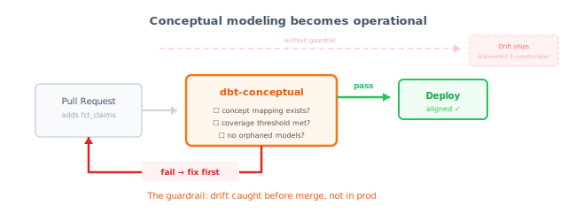

# Operational Conceptual Modeling

Conceptual models have always been planning artifacts — created early, referenced occasionally, updated never. dbt-conceptual changes that.

This page is about the operational aspect: what it means to have a conceptual model that's **versioned, validated, and enforced** alongside your code. If you're looking for why conceptual models matter in the first place, see [Why Conceptual Models Matter](README.md).

---

## What "operational" means

A conceptual model becomes operational when it:

- **Lives in the repo** — versioned in Git, changed via PR, reviewed like code
- **Validates in CI** — drift detected before merge, not discovered in production
- **Enforces thresholds** — coverage gates, mapping requirements, orphan detection
- **Stays current by necessity** — if it's wrong, the build fails

This is new. Tools like ERwin, Collibra, and even dbt's native documentation describe what exists — but none of them *enforce* alignment between concept and implementation. None of them fail your build.

---

## The insight

The tools to build this have existed for years. Git, CI, YAML, dbt's `meta` tag — no technical barrier. So why didn't this exist before?

Because nobody thought the whiteboard boxes were enough.

The entire history of data modeling assumed you needed the full cascade: conceptual → logical → physical. The whiteboard was a *precursor* to the real work — a sketch before the blueprint. If you couldn't do the full cascade, why bother starting?

So when delivery accelerated and the cascade broke, teams didn't think "let's just keep the boxes alive." They thought "we can't afford proper modeling anymore" — and abandoned the whole thing.

**dbt-conceptual's insight isn't technical. It's philosophical:**

> The whiteboard boxes — just the concepts and relationships, nothing more — are worth keeping alive. And keeping them alive doesn't require the cascade. It just requires putting them in the repo and validating them in CI.

That's it. That's the new thought.

Nobody built this before because nobody framed it this way. Everyone was trying to resurrect the full cascade, or abandon modeling entirely. The middle path — **operational concepts without the ceremony** — wasn't on the menu.

Until now.

---

## Pragmatism over purity

The modeling methodologies — Kimball, Data Vault, Anchor, 3NF, CIF — are fine. They're patterns for structuring data. A skilled architect can think in any of them, switch between them fluidly, apply them in any delivery context. The methodology isn't the problem.

What broke was the **organizational ceremony** that grew up around applying them:

- ERwin licenses and dedicated modeling teams
- Sign-off cycles and architecture review boards
- Months of upfront design before implementation could begin
- Separate artifacts in separate tools maintained by separate people

*That* couldn't keep pace with modern delivery. Daily deploys, lean teams, CI/CD pipelines — the ceremony became friction. So teams faced a false choice:

1. **Abandon structure entirely** — ship fast, accumulate chaos, hope tribal knowledge holds
2. **Fight the delivery model** — try to preserve the ceremony, create friction everywhere

Both paths fail. The first trades short-term velocity for long-term incoherence. The second burns energy on process instead of outcomes.

**dbt-conceptual is a third path: strip away the ceremony while preserving the value.**

You still get shared vocabulary. You still get conceptual clarity. You still get alignment between intent and implementation. You just don't need the tooling overhead, the separate artifacts, the review boards, the dedicated teams.

The conceptual model lives in the repo. It's validated in CI. It evolves through pull requests. It's maintained by the same people who write the code — because it *is* code.

### The conscious trade-off

dbt-conceptual makes a deliberate choice: **coherence over completeness**.

A full conceptual model with attributes, cardinality constraints, and formal notation would be more rigorous. It would also be more work to maintain, more friction to adopt, more likely to be abandoned.

The whiteboard boxes — concepts, relationships, ownership — are *enough* to:

- Maintain shared vocabulary across teams
- Detect when implementation drifts from intent
- Onboard new engineers without archaeology
- Surface coverage gaps before they become incidents

Enough is the point. Not everything. Enough.

---

## The contrast


| | Traditional | Operational |
|---|---|---|
| **Location** | Confluence, Lucidchart, ERwin | `concepts.yml` in the repo |
| **Versioning** | Manual snapshots | Git history |
| **Sync** | Hope and good intentions | CI validation |
| **Drift detection** | "Ask Sarah. She left in March." | `dcm validate` |
| **Enforcement** | Social pressure | Build gates |

The conceptual model stops being a separate artifact to maintain. It becomes part of the codebase — tested like code, deployed like code, current like code.

---

## The guardrail

dbt-conceptual integrates into your CI pipeline as a validation step:



Every PR can be checked:

- Does the new model declare what concept it implements?
- Does coverage still meet the threshold?
- Are there orphaned models with no conceptual home?

Fail a check, fix before merge. Drift is caught at the pull request, not three months later when someone asks "what does `fct_claims` actually measure?"

---

## The spectrum

dbt-conceptual doesn't force strict enforcement. You choose where on the spectrum you operate.

### Advisory mode

Visibility without gates. Reports, warnings, coverage metrics — but no blocked merges.

```yaml
vars:
  dbt_conceptual:
    coverage_threshold: 0
    require_concept_mapping: false
    warn_unmapped_models: true
```

Good for: adoption, exploration, brownfield projects with existing debt.

### Enforced mode

Hard gates. CI fails if alignment breaks.

```yaml
vars:
  dbt_conceptual:
    coverage_threshold: 90
    require_concept_mapping: true
    block_orphaned_models: true
```

Good for: mature projects, regulated environments, teams that want guardrails they can't route around.

Most teams start advisory and tighten over time. The tool supports the journey — you're never forced into strict mode, but it's there when you're ready.

---

## What this enables

### Governance that scales

You can't manually review every PR for conceptual alignment. CI can. The guardrails work at 2 AM, on the 50th PR of the week, when no architect is watching.

### Onboarding that works

New engineers don't need tribal knowledge. The conceptual model is in the repo. The mapping is explicit:

```yaml
models:
  - name: dim_customer
    meta:
      concept: Customer
      domain: Party
```

No archaeology required.

### Architecture that survives delivery pressure

Without guardrails, architecture erodes under deadline pressure. "Just ship it, we'll fix the naming later." Later never comes.

With operational enforcement, the conceptual model isn't a suggestion. It's a constraint — lightweight enough to not slow you down, firm enough to prevent silent drift.

### Documentation that can't go stale

The conceptual model is validated against the implementation on every build. If they diverge, CI fails. The only way forward is to fix the divergence — either update the model or update the implementation.

Staleness isn't possible. The feedback loop is too tight.

---

## Getting started

Start advisory. Add a minimal conceptual model. See coverage. Then decide how tight you want the guardrails.

```bash
dcm init       # scaffold concepts.yml
dcm coverage   # see current state
dcm validate   # check alignment
```

The model grows incrementally. Map one domain, see the value, expand from there.

→ [Quick Start](../getting-started/quick-start.md)
→ [CI Integration](../guides/ci-integration.md)
→ [Configuration Reference](../reference/configuration.md)
