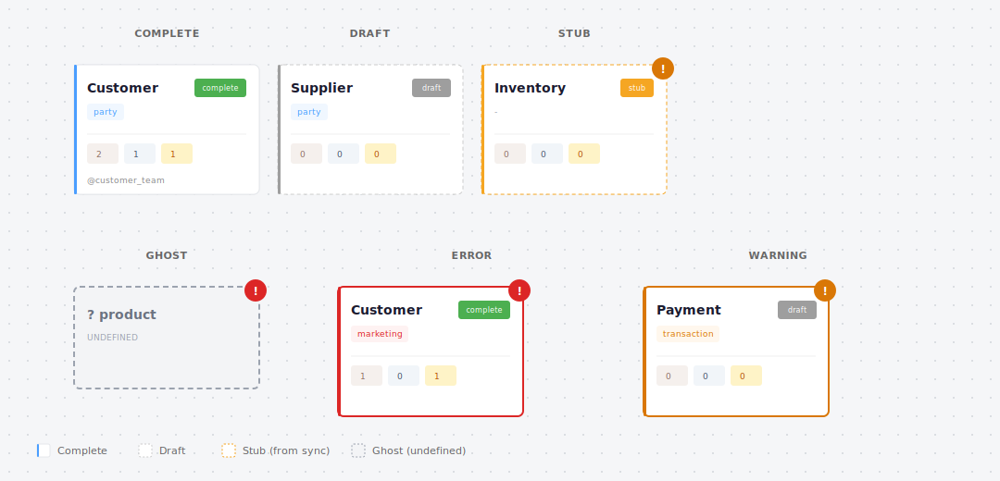

# Status & Coverage

Understanding what's complete, what's missing, and where to focus.

---

## Concept Status

Every concept has a status based on its completeness:

<figure>
  
</figure>

| Status | Meaning | Visual |
|--------|---------|--------|
| **Complete** | Has domain and implementing models | Solid border, green badge |
| **Draft** | Has domain, but no implementing models | Dashed border, gray badge |
| **Stub** | No domain assigned | Dashed orange border, warning badge |
| **Ghost** | Referenced but not defined | Gray fill, error badge |
| **Deprecated** | Has `replaced_by` set | Strikethrough, faded |

### How Status Is Calculated

```
Has replaced_by?           → deprecated
No domain?                 → stub
Has domain, no models?     → draft
Has domain and models?     → complete
Referenced but undefined?  → ghost
```

---

## Coverage

Coverage measures how much of your conceptual model is implemented.

```bash
dcm status
```

```
Coverage Summary
────────────────────────────────────
Gold layer:    18/20 models   (90%)
Silver layer:  12/35 models   (34%)

Concepts: 25 total
  - 20 complete
  - 3 draft
  - 2 stubs

Domains:
  party:       5/5 complete
  transaction: 8/10 complete (2 draft)
  catalog:     4/5 complete (1 stub)
  marketing:   3/5 complete
```

### What Gets Counted

**Model coverage:** Percentage of models with `meta.concept` tags.

**Concept coverage:** Percentage of concepts with at least one implementing model.

**Domain coverage:** Breakdown by domain.

---

## Orphan Models

An orphan model is a dbt model without a `meta.concept` tag.

```bash
dcm orphans
```

```
Orphan models (no meta.concept tag):

Gold layer:
  - mart_revenue_summary
  - dim_date

Silver layer:
  - int_customer_dedupe
  - int_order_enriched
```

Orphans aren't necessarily bad — not every model needs a concept. But orphans in the gold layer often indicate gaps in your conceptual model.

---

## Ghost Concepts

A ghost concept appears when a relationship references a concept that doesn't exist:

```yaml
relationships:
  - name: contains
    from: order
    to: order_line  # ← If order_line isn't defined, it's a ghost
```

<figure>
  
</figure>

Ghosts are validation errors — they indicate something is referenced but not defined. Fix by either:
- Defining the missing concept
- Removing the relationship

---

## Validation

The validate command checks for issues:

```bash
dcm validate
```

```
Validation Results
────────────────────────────────────
✓ All concepts have domains
✓ All relationships reference valid concepts
✗ 2 orphan models in gold layer
✗ 1 concept missing description

Errors: 0
Warnings: 2
```

### Validation Rules

| Rule | Checks For |
|------|------------|
| `orphan_models` | Models without concept tags |
| `unimplemented_concepts` | Concepts without implementing models |
| `missing_descriptions` | Concepts without descriptions |
| `invalid_references` | Relationships referencing undefined concepts |
| `invalid_domains` | Concepts referencing undefined domains |

### Configuring Severity

```yaml
vars:
  dbt_conceptual:
    validation:
      orphan_models: error           # Fail CI
      unimplemented_concepts: warn   # Show warning
      missing_descriptions: ignore   # Don't check
```

---

## Coverage Reports

Export coverage in various formats:

```bash
# Markdown (great for GitHub job summaries)
dcm export --type coverage --format markdown

# HTML (standalone report)
dcm export --type coverage --format html -o coverage.html

# JSON (for automation)
dcm export --type coverage --format json
```

### Markdown Output

```markdown
## Coverage Report

| Domain | Concepts | Complete | Draft | Coverage |
|--------|----------|----------|-------|----------|
| party | 5 | 5 | 0 | 100% |
| transaction | 10 | 8 | 2 | 80% |
| catalog | 5 | 4 | 1 | 80% |

**Overall: 85% coverage**
```

---

## Tracking Progress

Coverage improves over time. Track it in CI:

```yaml
# .github/workflows/ci.yml
- name: Coverage report
  run: |
    echo "## Conceptual Model Coverage" >> $GITHUB_STEP_SUMMARY
    dcm export --type coverage --format markdown >> $GITHUB_STEP_SUMMARY
```

This adds a coverage summary to every PR, making progress visible.

---

## Practical Targets

| Stage | Coverage Target | Focus |
|-------|-----------------|-------|
| Week 1 | Any | Get stubs created |
| Month 1 | 50% gold | Priority domains |
| Month 3 | 80% gold | All gold models |
| Ongoing | Maintain | Don't let it drift |

Don't aim for 100% immediately. 80% coverage that's maintained beats 100% coverage that decays.
