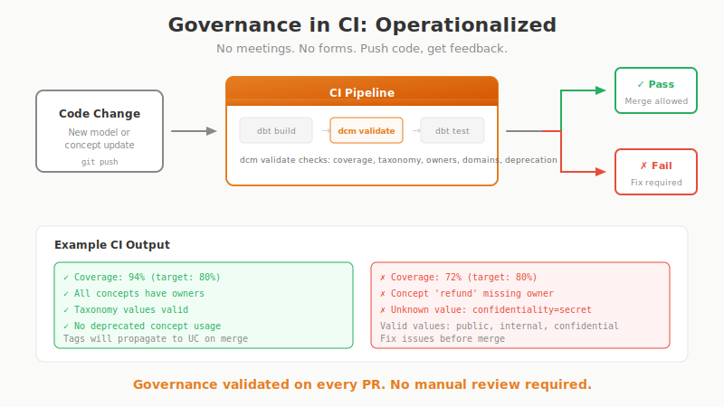

# CI/CD Integration

Adding dbt-conceptual to your CI pipeline helps catch drift before it merges. This guide covers common setups and patterns.

<figure>
  
</figure>

---

## Basic Setup

### GitHub Actions

Here's a minimal workflow that validates your conceptual model on every push:

```yaml
# .github/workflows/ci.yml
name: CI

on:
  push:
    branches: [main]
  pull_request:
    branches: [main]

jobs:
  validate:
    runs-on: ubuntu-latest
    steps:
      - uses: actions/checkout@v4
      
      - uses: actions/setup-python@v5
        with:
          python-version: '3.11'
      
      - name: Install dependencies
        run: pip install dbt-conceptual
      
      - name: Validate conceptual model
        run: dcm validate
```

### GitLab CI

```yaml
# .gitlab-ci.yml
validate-conceptual:
  image: python:3.11
  script:
    - pip install dbt-conceptual
    - dcm validate
```

---

## Starting Gently

If you're adding this to an existing project, you probably don't want CI to fail immediately on every gap. Here are a few approaches:

### Advisory Mode (Warnings Only)

See issues without blocking merges:

```yaml
- name: Validate (advisory)
  run: dcm validate
  continue-on-error: true
```

This runs validation and shows the output, but won't fail the build. Useful for getting visibility while you work through existing gaps.

### Enforced Mode

Once you're ready to enforce the standards:

```yaml
- name: Validate (enforced)
  run: dcm validate
```

Exit codes:
- `0` — Validation passed
- `1` — Validation errors found

### Strict Mode (No Drafts)

For mature projects where everything should be complete:

```yaml
- name: Validate (strict)
  run: dcm validate --no-drafts
```

This fails if any concepts are still in stub or draft status.

---

## Adding Job Summaries

GitHub Actions supports job summaries — formatted output that appears in the Actions UI. This makes it easier to see what's happening:

```yaml
- name: Conceptual model status
  run: |
    echo "## Conceptual Model" >> $GITHUB_STEP_SUMMARY
    dcm export --type coverage --format markdown >> $GITHUB_STEP_SUMMARY
```

This renders coverage as a table directly in the GitHub interface.

---

## Showing Changes in Pull Requests

You can show what changed in the conceptual model as part of a PR:

```yaml
- name: Show conceptual changes
  if: github.event_name == 'pull_request'
  run: |
    echo "## Changes" >> $GITHUB_STEP_SUMMARY
    dcm diff --base origin/main --format markdown >> $GITHUB_STEP_SUMMARY
```

Note: This requires fetching the full git history:

```yaml
- uses: actions/checkout@v4
  with:
    fetch-depth: 0  # Required for diff
```

---

## A More Complete Example

Here's a workflow that combines validation, coverage, and diff:

```yaml
name: Conceptual Model CI

on:
  push:
    branches: [main]
  pull_request:
    branches: [main]

jobs:
  validate:
    runs-on: ubuntu-latest
    steps:
      - uses: actions/checkout@v4
        with:
          fetch-depth: 0

      - uses: actions/setup-python@v5
        with:
          python-version: '3.11'

      - name: Install dbt-conceptual
        run: pip install dbt-conceptual

      - name: Validate
        run: dcm validate --format markdown >> $GITHUB_STEP_SUMMARY

      - name: Coverage
        run: |
          echo "## Coverage" >> $GITHUB_STEP_SUMMARY
          dcm export --type coverage --format markdown >> $GITHUB_STEP_SUMMARY

      - name: Changes (PR only)
        if: github.event_name == 'pull_request'
        run: |
          echo "## Changes in this PR" >> $GITHUB_STEP_SUMMARY
          dcm diff --base origin/main --format markdown >> $GITHUB_STEP_SUMMARY
```

---

## Configuring Validation Rules

You can tune what validation checks for in your `dbt_project.yml`:

```yaml
vars:
  dbt_conceptual:
    validation:
      orphan_models: warn           # Models without concept tags
      unimplemented_concepts: warn  # Concepts without models
      missing_descriptions: ignore  # Concepts without descriptions
```

Severity options:
- `error` — Fails validation (exit code 1)
- `warn` — Shows warning, passes validation
- `ignore` — Suppressed entirely

---

## Progressive Adoption

Here's a pattern that works well for teams adopting this gradually:

### Week 1: Advisory

```yaml
vars:
  dbt_conceptual:
    validation:
      orphan_models: warn
      unimplemented_concepts: warn
```

See warnings, understand the gaps, but don't block anything.

### Month 1: Soft Enforcement

```yaml
vars:
  dbt_conceptual:
    validation:
      orphan_models: warn
      unimplemented_concepts: error  # Must define concepts
```

Block PRs that reference concepts that don't exist, but allow untagged models for now.

### Month 3: Full Enforcement

```yaml
vars:
  dbt_conceptual:
    validation:
      orphan_models: error           # All models must be tagged
      unimplemented_concepts: error  # All concepts must have models
```

This is where you want to end up — but it's easier to get there gradually.

---

## Pre-commit Hooks

If you prefer catching issues before they're even committed:

```yaml
# .pre-commit-config.yaml
repos:
  - repo: local
    hooks:
      - id: validate-conceptual
        name: Validate conceptual model
        entry: dcm validate
        language: system
        pass_filenames: false
        files: conceptual\.yml$
```

This runs validation whenever `conceptual.yml` changes.

---

## Saving Reports as Artifacts

If you want to keep coverage reports:

```yaml
- name: Generate coverage report
  run: dcm export --type coverage --format html -o coverage.html

- name: Upload artifact
  uses: actions/upload-artifact@v4
  with:
    name: coverage-report
    path: coverage.html
```

---

## Exit Codes Reference

| Command | Exit 0 | Exit 1 |
|---------|--------|--------|
| `validate` | No errors | Has errors |
| `validate --no-drafts` | All complete | Has drafts/stubs |
| `diff` | Always | Never |
| `export` | Success | Error |
