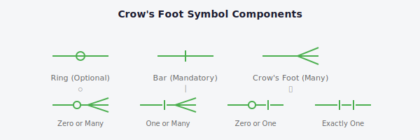
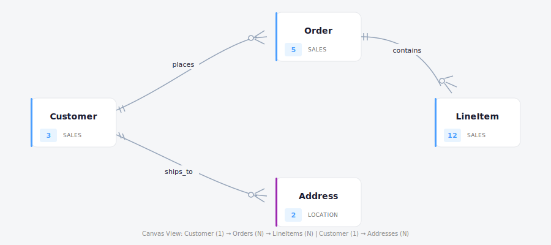

# Crow's Foot Cardinality Notation

> Visual specification for rendering relationship cardinality on the dbt-conceptual canvas.

---

## Overview

Replace the current text-based cardinality labels (e.g., "1:N") with standard Crow's Foot notation symbols at relationship line endpoints. This provides immediate visual recognition of cardinality without reading text.

---

## Symbol Components

### Base Elements

| Symbol | Name | Meaning | SVG Concept |
|--------|------|---------|-------------|
| `○` | Ring | Optional (zero permitted) | Small circle on line |
| `│` | Bar | Mandatory (at least one) | Short perpendicular line |
| `⋔` | Crow's foot | Many (multiple permitted) | Three lines diverging |

### Reading Direction

Symbols read **from the entity outward** along the line:

```
┌──────────┐
│  Entity  │──○│────────────────
└──────────┘  ↑↑
              ││
              │└─ Cardinality (one vs many)
              └── Optionality (ring vs bar)
```

---

## Cardinality Compositions

| Name | Notation | Symbol | Description |
|------|----------|--------|-------------|
| Zero or One | `0..1` | `○│` | Optional singular |
| Exactly One | `1..1` | `││` | Mandatory singular |
| Zero or Many | `0..*` | `○⋔` | Optional plural |
| One or Many | `1..*` | `│⋔` | Mandatory plural |

---

## Visual Mockups

### Symbol Reference



---

### One-to-Many (1:N) - Customer places Orders


---

### One-to-One (1:1) - User has Profile


---

### Many-to-Many via Bridge Table - Student Enrollment

Many-to-many relationships are modeled using a bridge (link) table. Each entity connects to the bridge with a one-to-many relationship, avoiding direct N:M connections.


---

### Canvas View (Multiple Relationships)

A larger canvas example showing multiple concepts with curved relationship lines:



---

### Draft Relationship Example


---

### No Cardinality (Current Arrow Style)


---

## Mapping from Current Cardinality Values

| Current Value | Source Symbol | Target Symbol | Interpretation |
|---------------|---------------|---------------|----------------|
| `1:1` | `││` | `││` | Exactly one on both ends |
| `1:N` | `││` | `○⋔` | One source, zero-or-many targets |
| `N:1` | `○⋔` | `││` | Zero-or-many sources, one target |
| `N:M` | — | — | Use bridge table (see Many-to-Many section) |
| (none) | — | `▶` | Keep current arrow, no cardinality symbols |

---

## Implementation Considerations

### 1. SVG Markers

React Flow uses SVG `<marker>` elements for edge endpoints. We need custom marker definitions:

```tsx
// In Canvas.tsx or a dedicated MarkerDefs component
<defs>
  <marker id="crowsfoot-zero-many" ...>
    {/* Ring + crow's foot */}
  </marker>
  <marker id="crowsfoot-one-many" ...>
    {/* Bar + crow's foot */}
  </marker>
  <marker id="crowsfoot-zero-one" ...>
    {/* Ring + bar */}
  </marker>
  <marker id="crowsfoot-one-one" ...>
    {/* Bar + bar */}
  </marker>
</defs>
```

### 2. Edge Configuration

Update edge creation in Canvas.tsx:

```tsx
// Current
markerEnd: { type: 'arrowclosed' }

// Proposed
markerStart: getMarkerForCardinality(cardinality, 'source'),
markerEnd: getMarkerForCardinality(cardinality, 'target'),
```

### 3. Color Inheritance

Markers should inherit or match the edge stroke color (status-based):
- Complete: `#4caf50` (green)
- Draft: `#9e9e9e` (gray)
- Stub: `#f5a623` (orange)
- Error: `#dc2626` (red)

### 4. Label Changes

- **Keep**: Verb label at center of edge
- **Remove**: Cardinality text (now shown via symbols)
- **Keep**: Model count badge (optional)

### 5. Sizing Guidelines

Based on current edge stroke width of 2px:

| Element | Size |
|---------|------|
| Ring radius | 5px |
| Bar length | 16px (8px each side of line) |
| Crow's foot spread | 12px per outer prong |
| Crow's foot angle | ~30° |
| Symbol spacing | 5px |
| Total marker width | ~25px |

---

## Files to Modify

| File | Changes |
|------|---------|
| `frontend/src/types.ts` | Keep existing `Cardinality` type |
| `frontend/src/components/Canvas.tsx` | Add marker defs, update edge config |
| `frontend/src/components/RelationshipEdge.tsx` | Remove cardinality text from label |
| `frontend/src/tokens.css` | Add marker styling if needed |

---

## Testing Checklist

- [ ] All four cardinality types render correctly
- [ ] Symbols orient correctly on curved Bezier paths
- [ ] Colors match edge status (complete/draft/stub/error)
- [ ] Self-referential relationships display properly
- [ ] Edges without cardinality show arrow only
- [ ] Symbols scale appropriately if zoom is implemented
- [ ] Export formats (PNG, SVG via Excalidraw) preserve symbols — see [CLI Reference](/.claude/doc/reference-cli.md) for export options
