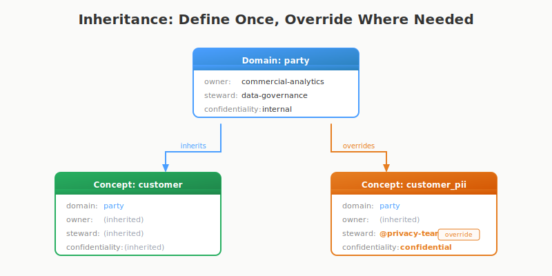

# Governance Features

## On Governance

Data governance has often been treated as something largely disconnected from the data team itself. But from my observations, this is changing.

Data teams are increasingly taking ownership of parts of governance practices, integrating them into their workflows rather than relegating them to a separate function. This shift is driven by the recognition that effective governance is essential for ensuring data quality, compliance, and trustworthiness — and that it works better when it's built in, not bolted on.

This is why dbt-conceptual expects, at minimum, a domain and owner for every concept. That's the bare bones — and it gives value from day one.

Not just for the governance office, but for the team itself. How often when something breaks have you been trying to chase down the data owner? Who do you notify? You can use placeholder values just to make it work, but honestly, those two things — domain and owner — benefit everyone involved. That's why they're included at the basic level, not hidden in an advanced settings menu.

dbt-conceptual also offers more advanced options: stewards, maturity levels, confidentiality classification, taxonomy validation. All optional out of the box. But if you're in a highly regulated business, you can use these to enforce validation as part of your workflow — manually during development, or as compliance gates in CI/CD.

The reasoning: governance doesn't have to be retrofitted after the fact. It can be part of the initial design and ongoing workflow, reducing later work and friction for both the data teams and the governance office.

The governance office still owns policy and compliance. But when domain, owner, and steward are already defined in the codebase — captured at design time, not chased down later — their job gets easier too.

Not for everyone. But for those that need it, this can be very helpful.

---

> **Note**: Core features — domains, ownership, descriptions, and CI validation — are available now. Extended governance features described below are in development. See [GitHub Issue #22](https://github.com/dbt-conceptual/dbt-conceptual/issues/22) for progress.

---

## What's Available Today

dbt-conceptual provides foundational governance metadata out of the box:

| Feature | Description |
|---------|-------------|
| Domains | Group concepts by business area |
| Ownership | Assign owners to domains and concepts |
| Descriptions | Document what concepts mean |
| Coverage tracking | See what's implemented vs. what's missing |
| CI validation | Catch drift in pull requests |

For many teams, this is enough. Domains, ownership, descriptions — all versioned in git, validated in CI. That's more structure than most teams have today, and it stays current because it's part of the development workflow.

---

## What This Isn't

dbt-conceptual is not a governance platform. It won't replace Collibra, Purview, or Alation. But it can complement them.

| Capability | dbt-conceptual | Full Governance Platform |
|------------|----------------|--------------------------|
| Domain ownership | ✓ | ✓ |
| Concept descriptions | ✓ | ✓ |
| Lineage (concept → model) | ✓ | ✓ |
| Approval workflows | — | ✓ |
| Policy enforcement | — | ✓ |
| Cross-platform catalog | — | ✓ |
| Compliance reporting | — | ✓ |

**If you don't have formal governance yet** — dbt-conceptual might be enough to get started.

**If you're on Databricks** — The metadata aligns with Unity Catalog. Domains and ownership can feed your tagging and access policies.

**If you have enterprise governance tooling** — dbt-conceptual can be a feeder. Concepts stay current in the codebase, then sync to your catalog of record.

---

## Coming Soon

These features are in development. They follow the same philosophy: define metadata where the work happens, validate automatically, inherit sensibly.

### Stewardship

Sometimes the person who builds something isn't the person who governs it. Stewardship lets you separate those roles:

```yaml
domains:
  party:
    owner: party-team
    governance:
      steward: data-governance

concepts:
  customer:
    domain: party
    governance:
      steward: "@sarah.chen@corp.com"  # Override domain steward
```

Concepts inherit `steward` from their domain, just like they inherit `owner`. Override at the concept level where needed.

### Automatic Notifications via @mentions

Use email-style mentions for stewards, and CI can automatically notify them when their concepts change:

```yaml
concepts:
  customer:
    owner: commercial-analytics
    governance:
      steward: "@sarah.chen@corp.com"
    
  order:
    owner: orders-team  
    governance:
      steward: "@james.wu@corp.com"
```

When a PR modifies these concepts, the CI output can include:

```markdown
## Conceptual Model Changes

| Concept | Change | Steward |
|---------|--------|---------|
| customer | description updated | @sarah.chen@corp.com |
| order | new relationship | @james.wu@corp.com |

cc: @sarah.chen@corp.com @james.wu@corp.com
```

GitHub and GitLab automatically notify mentioned users. Governance awareness without scheduling meetings.

### Maturity Levels

Signal how trustworthy data is:

```yaml
concepts:
  customer:
    governance:
      maturity: high      # Production-ready, trusted

  experimental_metric:
    governance:
      maturity: low       # Use with caution
      deprecated: true    # Show warning when referenced
```

| Level | Meaning |
|-------|---------|
| high | Production-ready, trusted, governed |
| medium | Validated, some caveats |
| low | Experimental, use with caution |

### Confidentiality Classification

High-level classification at the concept level:

```yaml
domains:
  party:
    governance:
      confidentiality: internal

concepts:
  customer:
    domain: party
    governance:
      confidentiality: confidential  # Override domain default
      regulatory: [GDPR, CCPA]
```

Concepts inherit `confidentiality` from their domain. Override where needed.

Note: Column-level classification (which specific columns contain PII) is still your governance platform's responsibility. This is about concept-level metadata.

### Taxonomy Validation

Define allowed values and validate them in CI:

```yaml
# models/conceptual/taxonomy.yml
version: 1

confidentiality:
  - key: public
    description: "No restrictions"
  - key: internal
    description: "Employees only"
  - key: confidential
    description: "Need-to-know"

regulatory:
  - key: GDPR
  - key: CCPA
  - key: SOX
```

Enable validation:

```yaml
vars:
  dbt_conceptual:
    governance:
      enforce_taxonomy: true
```

This catches typos and ensures consistent vocabulary. "confidental" gets flagged, not silently accepted.

---

## Inheritance

A key design principle: **define once, inherit down, override where needed.**

<figure>
  
</figure>

```yaml
domains:
  party:
    owner: party-team
    governance:
      steward: data-governance
      confidentiality: internal

concepts:
  customer:
    domain: party
    # Inherits: owner, steward, confidentiality from party domain
    
  customer_pii:
    domain: party
    governance:
      confidentiality: confidential  # Override: more sensitive
      steward: "@privacy-team"       # Override: different steward
```

This reduces repetition and makes it clear where the defaults come from.

---

## Configuration (Planned)

All optional, all off by default:

```yaml
vars:
  dbt_conceptual:
    governance:
      # Structural requirements
      require_steward: false
      require_maturity: false
      require_confidentiality: false
      
      # Behavioral constraints  
      enforce_deprecated_as_error: false
      enforce_taxonomy: false
      
      # Notifications
      mention_stewards_on_change: true
```

The philosophy: everything works by default. Add requirements when you're ready for them. Start permissive, tighten over time.

---

## The Handoff

One way to think about how dbt-conceptual and your governance platform work together:

<figure>
  
</figure>

**dbt-conceptual provides:**
- Business context (domains, descriptions)
- Ownership and stewardship
- Coverage and drift detection
- Change visibility via CI
- Metadata captured at design time

**Your governance platform handles:**
- Column-level classification (PII/PHI)
- Access control and enforcement
- Compliance reporting
- Audit trails
- Cross-platform catalog

dbt-conceptual handles the high-level vocabulary — the stuff that's useful to define close to the code. Your governance platform handles detailed enforcement and compliance.

They're complementary. dbt-conceptual makes the governance platform's job easier by ensuring the basics are already captured at the source.

---

## Getting Started

You don't need extended governance features to get value. Start with what's available today:

1. Define domains and assign ownership
2. Write descriptions for your key concepts
3. Enable CI validation

That's governance for most teams — in a form that stays current because it's part of your development workflow.

The advanced features will be there when you need them.
