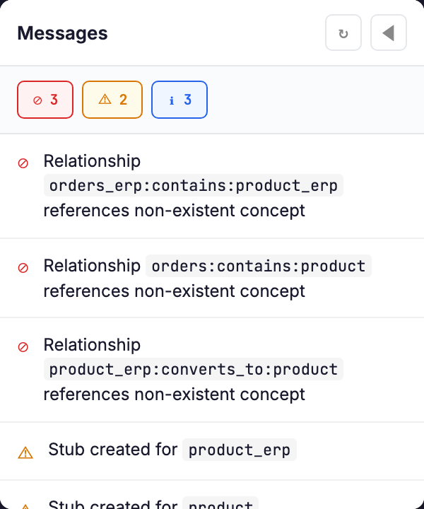

# Web UI

dbt-conceptual includes an interactive web interface for visualizing and editing your conceptual model.

## Getting Started

Install with the serve extra:

```bash
pip install dbt-conceptual[serve]
```

Launch the UI:

```bash
dcm serve
```

Open your browser to `http://localhost:5001`.

## Demo Mode

Try the UI without a dbt project:

```bash
dcm serve --demo
```

This launches with a self-contained example — four concepts, relationships, and models across bronze/silver/gold layers. Changes are not persisted.

## Features

### [Canvas Editor](canvas.md)

The main visual workspace:
- Drag concepts to position them
- Draw relationships between concepts
- Select elements to edit in the property panel
- Auto-layout with Dagre algorithm


### [Coverage View](coverage.md)

See implementation status:
- Concepts grouped by domain
- Status badges (complete/draft/stub)
- Drill down to implementing models

### [Bus Matrix](bus-matrix.md)

Kimball-style dimensional matrix:
- Dimensions as columns
- Facts as rows
- Check marks show relationships


## Keyboard Shortcuts

| Key | Action |
|-----|--------|
| `Delete` | Delete selected element |
| `Escape` | Clear selection |
| `Ctrl+S` | Save changes |
| `Ctrl+Z` | Undo |

## Views

Switch between views using the sidebar:
- **Canvas** — Visual graph editor
- **Coverage** — Implementation status
- **Bus Matrix** — Dimensional coverage

## Sync Button

Click the sync button to:
1. Scan your dbt project for tagged models
2. Match models to concept definitions
3. Update coverage status
4. Surface validation messages

## Messages Panel

The messages panel shows validation results:

| Type | Meaning |
|------|---------|
| Error | Broken references, duplicates |
| Warning | Missing models, stubs created |
| Info | Sync summary, mappings |


