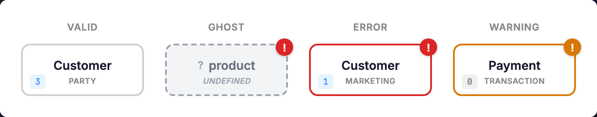
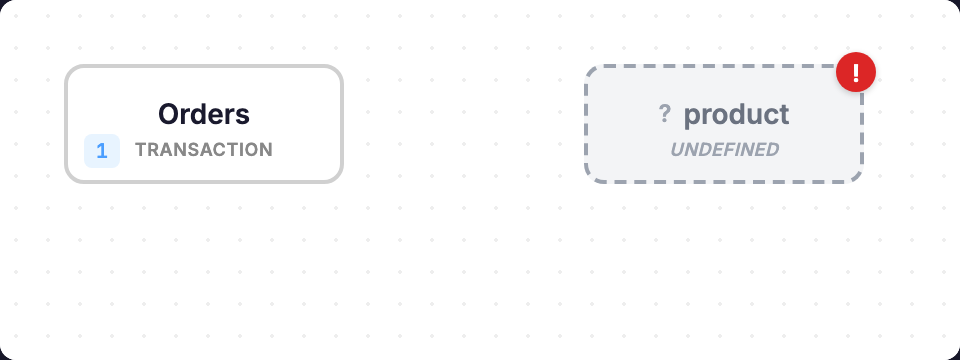

# Canvas Editor

The canvas is the primary workspace for visualizing and editing your conceptual model.

## Overview

The canvas displays:
- **Concepts** as nodes with domain colors
- **Relationships** as directed edges with verb labels
- **Status indicators** showing complete/draft/stub states

## Working with Concepts

### Creating a Concept

1. Click the **+** button in the toolbar
2. Enter the concept name
3. The concept appears on the canvas as a stub

### Selecting a Concept

Click a concept to select it. The property panel opens on the right.

### Moving Concepts

Drag concepts to reposition them. Positions are saved to `conceptual.layout.json`.

### Editing Properties

With a concept selected, use the property panel to edit:
- Name and definition
- Domain assignment
- Owner
- Color override

### Deleting a Concept

Select the concept and press `Delete`, or use the delete button in the property panel.

## Working with Relationships

### Creating a Relationship

1. Select a concept (the "from" concept)
2. Hold `Shift` and click another concept (the "to" concept)
3. Enter the verb in the dialog

### Editing Relationships

Click a relationship line to select it. The property panel shows:
- From/to concepts
- Verb
- Cardinality
- Definition

### Deleting a Relationship

Select the relationship and press `Delete`.

## Layout

### Manual Layout

Drag concepts to arrange them. Positions persist across sessions.

### Auto Layout

Click the **Auto Layout** button to apply the Dagre algorithm. This arranges concepts in a hierarchical flow.

### Reset Layout

Delete `conceptual.layout.json` to reset all positions.

## Visual Indicators

### Concept States

| Visual | Meaning |
|--------|---------|
| Solid fill | Complete (has implementing models) |
| Dashed border | Draft (needs implementation) |
| Gray, dashed | Stub (needs domain) |
| Ghost icon | Ghost (referenced but undefined) |

### Domain Colors

Concepts inherit color from their domain. Override with the color property.

### Relationship Lines

| Style | Meaning |
|-------|---------|
| Solid | Complete relationship |
| Dashed | Draft status (missing domain) |
| Gray | Stub status |

## Property Panel

The right panel shows details for the selected element:

### Concept Properties
- Name (display name)
- Domain (dropdown)
- Owner
- Definition (markdown)
- Status (derived)
- Implementing models (read-only)

### Relationship Properties
- From/to concepts
- Verb
- Cardinality
- Domain(s)
- Definition
- Realized by (read-only)

## Ghost Concepts

When a relationship references an undefined concept, a "ghost" placeholder appears.

To resolve:
1. Click the ghost to select it
2. Save to create a real stub concept
3. Or fix the underlying relationship reference

## Keyboard Shortcuts

| Key | Action |
|-----|--------|
| `Delete` | Delete selected element |
| `Escape` | Clear selection |
| `Shift+Click` | Create relationship from selected concept |

## Tips

- Use domains to organize large models
- Position related concepts near each other
- Use auto-layout as a starting point, then adjust manually
- Check ghost concepts after sync — they indicate reference errors
